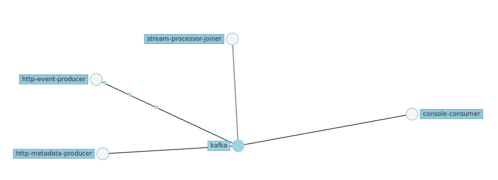
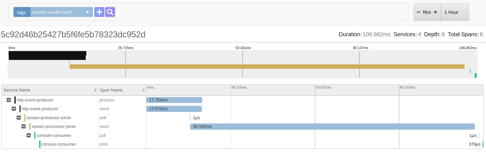
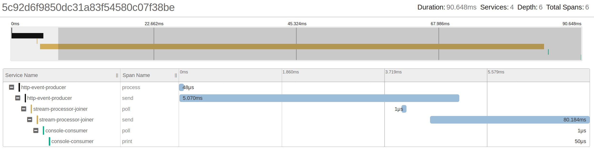

# Tracing Kafka-based Applications

Evaluation of Kafka client configurations via distributed tracing.

## Use-case

+ **Producers**: `http-event-producer`, `http-metadata-producer`
+ **Stream-Processors**: `stream-processor-joiner`
+ **Consumers**: `console-consumer`

Events and Metadata messages are sent to an input Kafka topic, a Stream application
store Metadata messages as a table representation, and join Events and Metadata
messages, to then send them to another Kafka topic. A Consumer polls from 
the final Kafka topic and process joined messages.



## Scenarios

### Default

- `Event producer`: synchronous send.
- `Console consumer`: auto-commit.

```java
public class EventPublisher {
  //...
  void publish() throws Exception {
    var record = new ProducerRecord<>(topic, "A", "A");
    kafkaProducer.send(record).get();
  }

}
```




We can see that HTTP response is blocked by `kafkaProducer.send()` operation completes.

As record is stored in Kafka topic, consumption starts even before HTTP response is
returned.

Consumer poll and consume as soon as possible.

### Producer async send

- `Event Producer`: async send.
- `Console consumer`: auto-commit.

```java
public class EventPublisher {
  // ...  
  void publish() throws Exception {
    var record = new ProducerRecord<>(topic, "A", "A");
    kafkaProducer.send(record);
  }
}
```



Instead of waiting for an acknowledge from the Kafka broker, producer does not block, and HTTP return response after async send has complete.

Consumer poll and consume as soon as possible.

### 