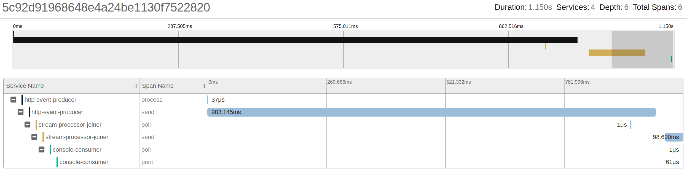
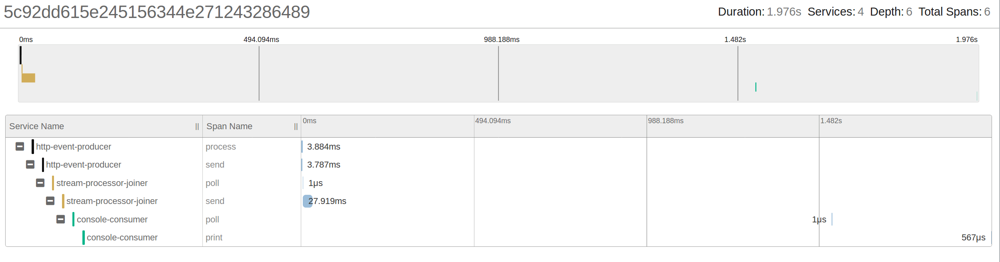

# Tracing Kafka-based Applications

Evaluation of Kafka client configurations via distributed tracing.

## Requirements

+ JDK 11
+ Docker engine, Docker compose
+ [wrk](https://github.com/wg/wrk)

## Use-case

+ **Producers**: `http-event-producer`, `http-metadata-producer`
+ **Stream-Processors**: `stream-processor-joiner`
+ **Consumers**: `console-consumer`

Events and Metadata messages are sent to an input Kafka topic, a Stream application
store Metadata messages as a table representation, and join Events and Metadata
messages, to then send them to another Kafka topic. A Consumer polls from 
the final Kafka topic and process joined messages.


## How to run

```bash
make # this will build containers, start compose, create topics
# after it completes
make perf-test # this will start http testing took to create load.
```

## Scenarios

### Producer: sync send

- `Event producer`: synchronous send.
- `Console consumer`: auto-commit.

```java
public class EventPublisher {
  //...
  void publish() throws Exception {
    var record = new ProducerRecord<>(topic, "A", "A");
    kafkaProducer.send(record).get();
  }

}
```


We can see that HTTP response is blocked by `kafkaProducer.send()` operation completes.

As record is stored in Kafka topic, consumption starts even before HTTP response is
returned.

Consumer poll and consume as soon as possible.

### Producer: async send

- `Event Producer`: async send.
- `Console consumer`: auto-commit.

```java
public class EventPublisher {
  // ...  
  void publish() throws Exception {
    var record = new ProducerRecord<>(topic, "A", "A");
    kafkaProducer.send(record);
  }
}
```


Instead of waiting for an acknowledge from the Kafka broker, producer does not block, and HTTP return response after async send has complete.

Consumer poll and consume as soon as possible.

### Producer: batch send

- `Event Producer`: async, batched send.
- `Console Consumer`: auto-commit.

```java
public class EventPublisher {

  public EventPublisher(Tracing tracing, Config config) {
    var producerConfig = new Properties();
    //...
    producerConfig.put(ProducerConfig.BATCH_SIZE_CONFIG, 100000);
    producerConfig.put(ProducerConfig.LINGER_MS_CONFIG, 1000);
    //...
  }

  void publish() throws Exception {
    var record = new ProducerRecord<>(topic, "A", "A");
    kafkaProducer.send(record);
  }
}
```



Every message will be buffered until a batch of 100KB (`batch.size`) is created, 
or 1 second  times out (`linger.ms`).

Depending on how your message is positioned as part of the batch, your transaction
can take up to a second to send a message.

We only execute 1 round-trip (depending on `acks` and `min.isr`) for every batch.

### Consumer: commit per record

- `Event Producer`: sync send.
- `Console Consumer`: commit per record.

```java
public class ConsoleConsumer implements Runnable {
  private void printRecord(Consumer<String, String> consumer,
      ConsumerRecord<String, String> record) {
      // processing
      consumer.commitSync(
          Map.of(
              new TopicPartition(record.topic(), record.partition()),
              new OffsetAndMetadata(record.offset())));
    // ...
  }

  @Override public void run() {
    try (Consumer<String, String> tracingConsumer =
             kafkaTracing.consumer(new KafkaConsumer<>(config))) {
      tracingConsumer.subscribe(topics);
      while (running.get()) {
        var records = tracingConsumer.poll(Duration.ofSeconds(1));
        records.forEach(r -> this.printRecord(tracingConsumer, r));
      }
    } // ...
  }

}
```



If we commit per record, is much harder for the consumer to keep up with the 
producer pace. In this trace, it took almost a second to consume the record
since it was produced.
